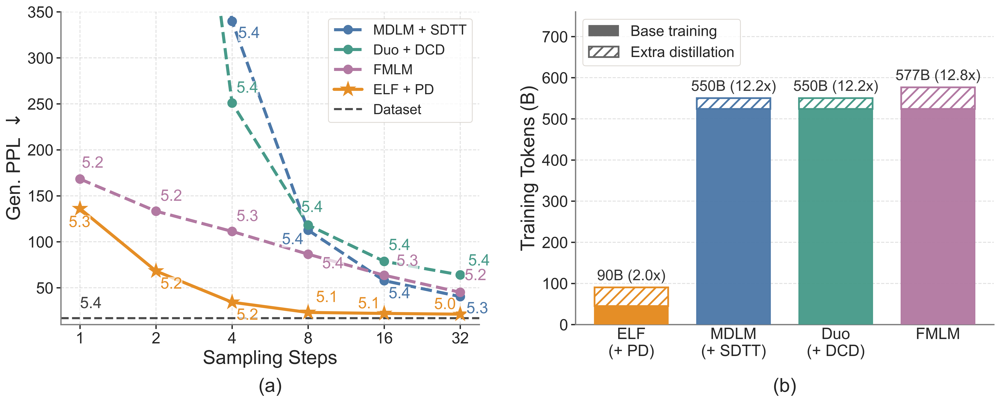

# Progressive Distillation of ELF

PyTorch implementation of progressive distillation (PD) for
[ELF: Embedded Language Flows](https://arxiv.org/abs/2605.10938). A many-step
ELF teacher is distilled into a few-step student via multi-round curriculum. ELF + PD achieves strong performance on few-step unconditional generation on OpenWebText. See the [blog post](https://linlu-qiu.github.io/assets/html/elf_pd.html) for details. 

<p align="center">
  
</p>


## Installation

Create a conda environment named `elf` and install the dependencies:

```bash
conda create -n elf python=3.10 -y
conda activate elf
pip install -r requirements.txt
```

Then log in to WandB to track your experiments if needed:

```bash
wandb login YOUR_WANDB_API_KEY
```

## Distilled Model

We release the final-round distilled student on HuggingFace:

| Model | Task | Params | HuggingFace Repo |
| --- | --- | --- | --- |
| ELF-B + PD | OpenWebText (unconditional) | 105M | [embedded-language-flows/ELF-B-PD-owt-torch](https://huggingface.co/embedded-language-flows/ELF-B-PD-owt-torch) |


## Reference Results

Few-step unconditional generation on OpenWebText with the released ELF-B + PD
student after five-round progressive distillation. Gen. PPL is computed under a
frozen GPT-2 Large; entropy is unigram entropy over the generated tokens.

| Steps | Gen. PPL ↓ | Entropy ↑ |
| --- | --- | --- |
| 1 | 136.10 | 5.26 |
| 2 | 68.25 | 5.24 |
| 4 | 34.33 | 5.16 |
| 8 | 23.18 | 5.07 |
| 16 | 22.12 | 5.06 |
| 32 | 21.32 | 5.04 |

## Distillation

Progressive distillation turns the teacher into a few-step student. Use our
trained teacher,
[embedded-language-flows/ELF-B-owt-torch](https://huggingface.co/embedded-language-flows/ELF-B-owt-torch)
(set as `teacher_path` in the config, pulled automatically).

Run a single distillation round:

```bash
NGPU=8 bash scripts/launch.sh distill src/configs/training_configs/distill_curriculum_ELF-B.yml
```

Override `pd_step_size` / `pd_teacher_steps` to change the round (e.g.
`--config_override pd_step_size=0.125 --config_override pd_teacher_steps=8` for an
8-step student). To run the full five-round curriculum end to end:

```bash
bash scripts/progressive_distillation.sh
```

`TEACHER_PATH`, `BASE_DIR`, `START_ROUND`, and `NGPU` are overridable via env
vars — see the header of the script.

## Evaluation

Evaluate the distilled student across step counts (the config sweeps
1/2/4/8/16/32 steps):

```bash
NGPU=8 bash scripts/launch.sh eval src/configs/training_configs/distill_curriculum_ELF-B.yml \
    --checkpoint_path embedded-language-flows/ELF-B-PD-owt-torch
```

Generative perplexity (GPT-2 Large) is computed automatically. You can also run
it standalone on the saved samples:

```bash
python scripts/eval_ppl.py --input outputs/<run>/<sampling_dir>/all_generated_*.jsonl
```
